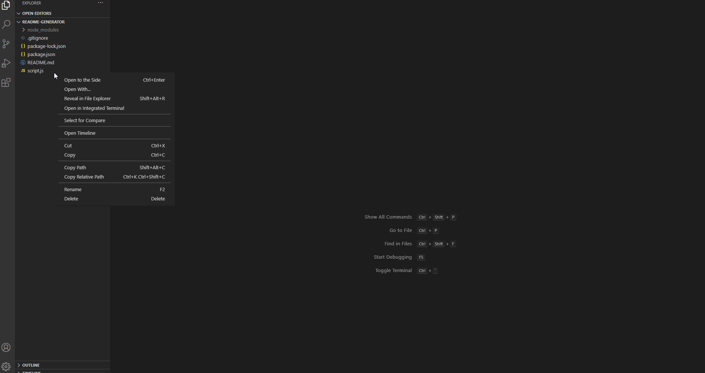

# ReadMe-Generator
## Table of Contents
* Description
* Installation
* Usage
* Contributions
* Licensing
* Tests
* Questions
## Description
This application is a backend JavaScript application that utilizes prompts from inquierer and creates a professional README.MD file with ease using the writeFile method.
## Installation
This application can be cloned from the GitHub repository to a local repository that can be run in a Code Editor, such as Visual Code Studio.
## Usage
The purpose of this application is to be able to generate a complete README.MD file from scratch using a template of prompts for the user. This gives the user an easy and quick way to organize information related to any project that they are creating or working on.
## Contributions
There were no external contributers to the application.
## Licensing

## Tests
Users can test this application by opening their Integrated Terminal within the folder containing the cloned application. Within the terminal, enter "node script.js" in the command line. Afterwards, the user will be prompted a series of questions that will be used to generate their README.MD file.
## Questions
* My repositories can be found at https://www.github.com/aseppala98
* For any questions regarding this application, you can email me at SeppalaErin98@gmail.com

